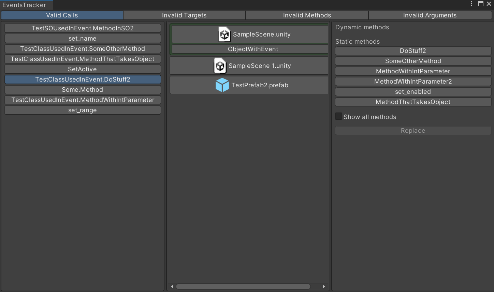
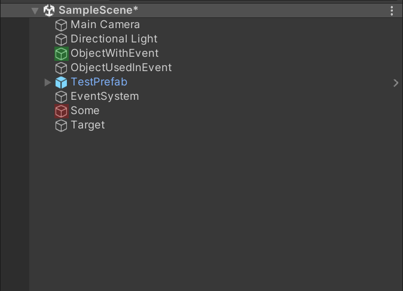
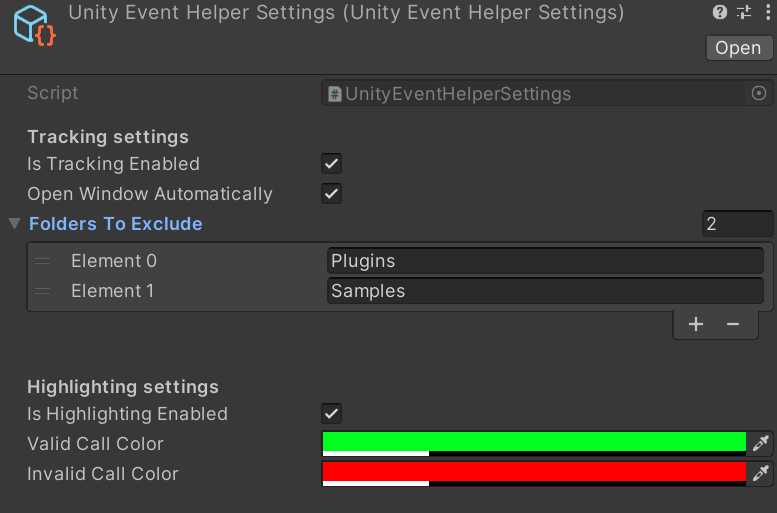
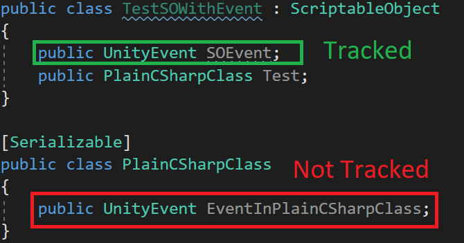

# UnityEventTracker
This is a set of tools created to help you track persistent calls defined in all*(see [Limitations](#limitations)) serialized `UnityEvent`'s in your project.

# Showcase 
[Demo](https://drive.google.com/file/d/1TedVwDfF8lCF3X_qqa1OsbR6lC5PaE4B/view?usp=sharing) (Do not forget to change quality from default 360p).

# Instalation
You can install this package in the following ways:
- Download the latest *.unitypackage* form the [Release page](https://github.com/ApxfIy/UnityEventTracker/releases) and import it into your project via `Assets => Import Package`
- Go to `Window => PackageManager => "+" icon in the top-left => Add package from git URL` and paste this URL `"https://github.com/ApxfIy/UnityEventTracker.git#upm"`

Once imported, *UnityEventTracker* will start an initial scan of your project. Please wait for it to finish.

# Terms

*Target Object* - an object in the scene or an asset that has component(s) attached with a serialized field(s) of type `UnityEventBase`

# Usage
You can open main UnityEventTracker window via `Tools => UnityEventTracker => Open Window`. Window itself looks like this:

Top toolbar contains 4 tabs:
1. Valid Calls 
  - The first column displays a list of methods that are used in the persistent calls in the project. Note that the methods are grouped
  - The second column displays a list of assets that contain [Target Object(s)](#target-object) or are themselves [Target Objects](#target-object) that have persistent call(s) to the method selected in the first column. Click on the asset button will "open" this asset (load if the asset is a scene/prefab and select if the asset is ScriptableObject)
  - The Third column displays a list of methods that can be used to replace method selected in the first column. You can select desired method and click "Replace" button to replace currently used method with a new one in every asset. If `Show all methods` toggle is off methods declared in some base Unity types won't be shown https://github.com/ApxfIy/UnityEventTracker/blob/4aea9b970a0f3fea6560e20a122233cdc01872df/Assets/UnityEventTracker/Scripts/Editor/Window/Tabs/BaseGroupedMethodsTab.cs#L147-L154
2. Invalid Target
  - Displays a list of assets that contain [Target Object(s)](#target-object) or are themselves [Target Objects](#target-object) that have persistent call(s) with invalid target (target object was deleted or not assigned). Click on the asset button will "open" this asset (load if the asset is a scene/prefab and select if the asset is ScriptableObject)
3. Invalid Method
  - Looks like the *Valid Calls* tab, but every persistent call in this tab is invalid, because the method used in the call was deleted/renamed/moved or its signature has changed and no longer compatable with the `UnityEvent` signature
4. Invalid Argument
  - Displays a list of assets that contain [Target Object(s)](#target-object) or are themselves [Target Objects](#target-object) that have persistent call(s) accepts argument that extends `UnityEngine.Object` type and this argument is invalid (argument object was deleted or not assigned). Click on the asset button will "open" this asset (load if the asset is a scene/prefab and select if the asset is ScriptableObject). Note that in this case, sometimes the null argument expresses the desired behavior. In this case, just ignore this call. I could add functionality to add such a call to the ignore list in the future

If you think that window is not showing you correct information, for example it displays persistent calls that no longer exist or not displaying some calls (see [Limitations](#limitations)), you can re-scan your project via `Tools => UnityEventTracker => Scan Project`. Please note that scenes not included in the build will be skipped.

## Event Highlighting
Highlights [Target Objects](#target-object). If all persistent calls on the [Target Object](#target-object) are valid, the object is highlighted in `green`. If at least one of persistent calls is invalid, the object is highlighted in `red` . 

# Settings

You can select setting object via `Tools => UnityEventTracker => Show Settings`.

1. Tracking Settings
  - `Is Tacking Enabled` -  toggles tracking. If set to "true", the tracker will automatically update the internal list of persistent calls in the project when deleting/creating/modifying asset(s)
  - `Open Window Automatically` - if set to `true` each time the internal list of persistent calls is changed, the [Main Window](#main-window) will be open automatically if at least one of the persistent calls is invalid
  - `Folders To Ignore` - list of folders ignored by the tracker. All files in these folders (including scripts) will be skipped when scanning the project.
2. Highlighting Settings
  - `Is Highlighting Enabled` - toggles [Event Highlighting](#event-highlighting)
  - `Valid Call Color` - color used to highlight [Target Objects](#target-object) with invalid persistent call(s)
  - `Invalid Call Color` - color used to highlight [Target Objects](#target-object) with valid persistent call(s)

# Limitations
Currently, `UnityEvent(s)` declared in plain C# classes are not tracked/highlighted. I plan to add support for these calls it in the future.
In the example below, `UnityEvent` SOEvent declated in `TestSOEventClass` is tracked by this tool, but `UnityEvent` EventInPlainCSharpClass declared in `PlainCSharpClass` is not tracked.

# Bug Report

This tool creates log files at `Assets/Plugins/UnityEventTracker/Logs` if it failed to scan some asset. Please, note, that log files contains full YAML representation of asset (scene, prefab or SO) that failed to be scanned. This representation might contains some private information (API keys, passwords etc.) so you might want to delete it from log file before sending them. After sending the logs you should delete them.
If you faced any bug/error, please, open a new [Issue](https://github.com/ApxfIy/UnityEventTracker/issues) so I can improve this tool.
